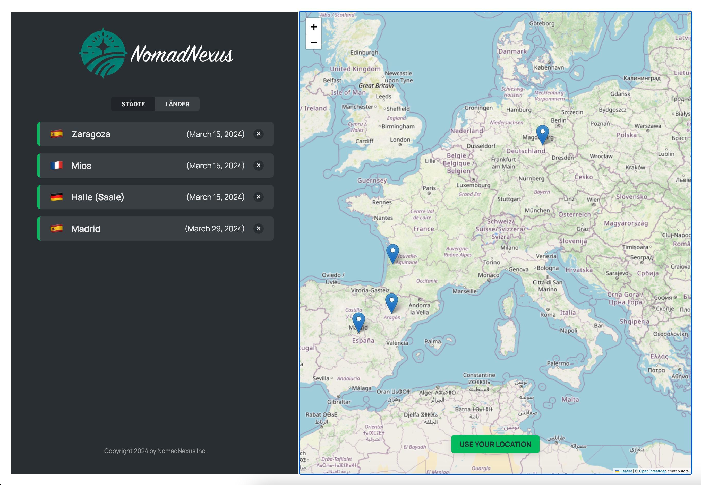

<h2>Dieses Demo-Projekt illustriert die Erstellung einer interaktiven Reisekarten-Anwendung, die es Benutzern ermöglicht, Städte auf einer Karte zu erkunden und zu verwalten.</h2>

<h3>Hauptmerkmale:</h3>

<ul>
  <li><strong>Interaktive Karte:</strong> Implementiert mit Leaflet, erlaubt diese Karte den Nutzern, Städte zu markieren und zu ihrer persönlichen Reiseliste hinzuzufügen.</li>
  <li><strong>API-Datenabfrage:</strong> Die Anwendung simuliert das Fetching von Daten und bietet vollständige CRUD-Operationen durch die Nutzung eines Fake JSON Servers.</li>
  <li><strong>Zustandsmanagement:</strong> Nutzt React's Context API und den Reducer-Hook, um einen zentralisierten, globalen Zustand für die Anwendung zu schaffen.</li>
</ul>

  

